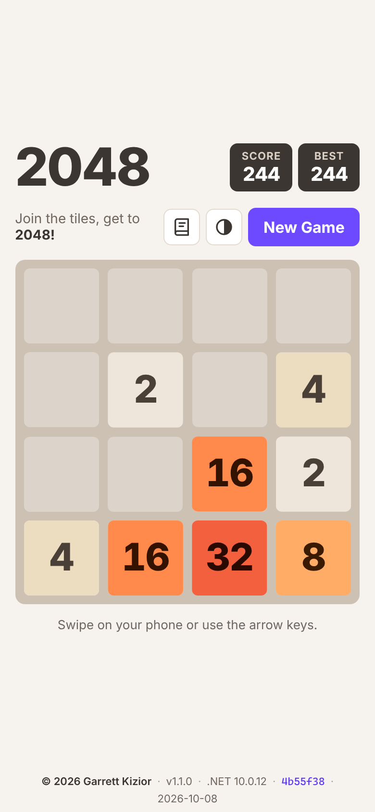
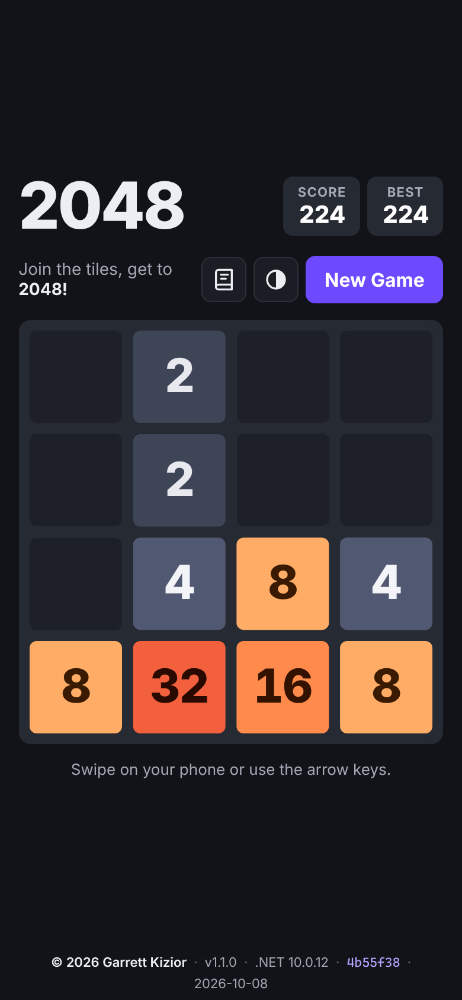

# Blazor 2048

[](https://github.com/gkizior/blazor-2048/actions/workflows/deploy.yml)
[](https://gkizior.github.io/blazor-2048/)
[](https://dotnet.microsoft.com/download/dotnet/10.0)
[](https://learn.microsoft.com/aspnet/core/blazor/)

The classic **2048** sliding-tile puzzle, built with **.NET 10 Blazor WebAssembly** as an installable PWA.
Play it on your iPhone straight from Safari — no Mac, no App Store, no fees.

**Play:** https://gkizior.github.io/blazor-2048/

| Light | Dark |
|---|---|
|  |  |

## Features

- Standard 4×4 2048: slide tiles, merge equal numbers, reach 2048
- Swipe on touch screens, arrow keys (or WASD) on desktop
- Smooth CSS animations: tiles slide, merges pop, new tiles scale in; input is never blocked,
  and `prefers-reduced-motion` is respected
- Light, dark and system themes with a modern, high-contrast palette (remembered on the device)
- Score, plus best score saved on the device
- Win and game-over messages, "Keep going" after 2048, and a New Game button
- Built-in docs (the 📖 button): every Markdown file in this repo, with diagrams, in a DocFX-style viewer
- Footer with the .NET runtime version, app version, commit and build date
- Mobile-first layout that fits an iPhone screen with no scrolling or bounce
- Works offline and runs full-screen when added to the home screen

## How it's built

| Path | What's there |
|---|---|
| `src/Game2048.Core` | Pure C# game logic (`Game.cs`): sliding, merging, spawning, win/lose, tile ids for animations |
| `src/Blazor2048` | Blazor WebAssembly PWA: game board, theming, docs viewer, footer |
| `tools/DocsBuilder` | Build-time tool: Markdown → HTML (Markdig), Mermaid → SVG (mermaid-cli) |
| `docs/` | Project docs shown in the app ([architecture](docs/architecture.md), [engine](docs/game-engine.md), [testing](docs/testing.md), ...) |
| `tests/Blazor2048.Tests` | xUnit v3 tests: game rules, tile tracking, docs generator, palette contrast |
| `tests/Blazor2048.ComponentTests` | bUnit tests for the components (board, input, theme, footer, docs) |
| `tests/Blazor2048.E2ETests` | Playwright for .NET end-to-end tests (`Microsoft.Playwright.Xunit.v3`) against the published app |
| `scripts/prepare-pages.py` | Sets `<base href>` for GitHub Pages and adds `404.html` and `.nojekyll` |
| `.github/workflows/deploy.yml` | Builds, tests, publishes, and deploys to GitHub Pages |

It's Blazor first. Input, animations, theming and the docs are C#, Razor and CSS. There's no custom
JavaScript: the only JS interop is the call to the browser's built-in `localStorage` (in
`Services/BrowserStorage.cs`), so the best score and theme survive a reload. Mermaid diagrams are
pre-rendered to SVG at build time, so no diagram library runs in the browser.
See [Architecture](docs/architecture.md) for the details.

## Run it locally

Requires the [.NET 10 SDK](https://dotnet.microsoft.com/download).

```bash
git clone https://github.com/gkizior/blazor-2048.git
cd blazor-2048
dotnet test                       # xUnit v3 + bUnit tests (Microsoft.Testing.Platform, see global.json)
dotnet run --project src/Blazor2048
```

Then open the URL printed in the terminal (for example `http://localhost:5000`).

End-to-end tests need Chromium for Playwright once, then run opt-in:

```bash
pwsh tests/Blazor2048.E2ETests/bin/Debug/net10.0/playwright.ps1 install chromium
RUN_E2E=1 dotnet test --project tests/Blazor2048.E2ETests
```

## Add it to your iPhone home screen

1. Open **https://gkizior.github.io/blazor-2048/** in **Safari**.
2. Tap the **Share** button (the square with an arrow pointing up).
3. Scroll down and tap **Add to Home Screen**, then tap **Add**.

It now opens full-screen from its own icon, like an app, and works offline.

## Deploying

Every push to `main` runs the GitHub Actions workflow. It builds the app, runs the xUnit and bUnit tests,
publishes the site, runs the Playwright E2E tests against those exact files, and deploys them with
`actions/deploy-pages`. Deployment only happens if all of the tests pass. Pull requests (including
Dependabot's weekly updates) run the same tests without deploying.
See [Build and deploy](docs/build-and-deploy.md).
