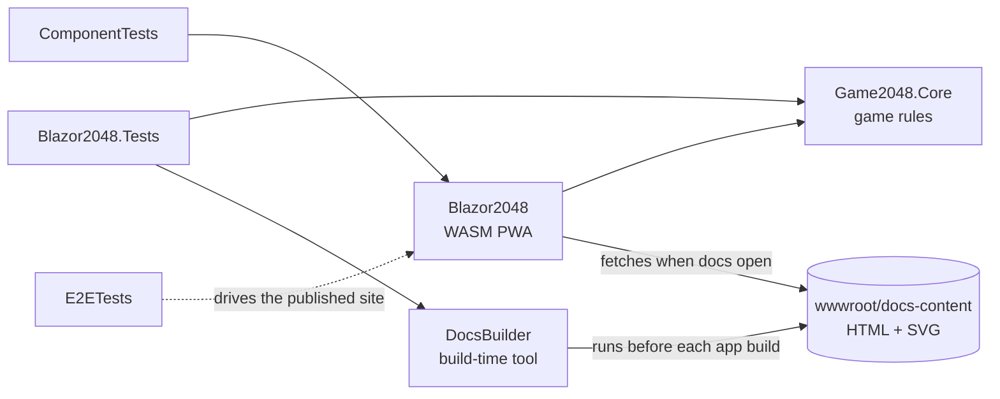
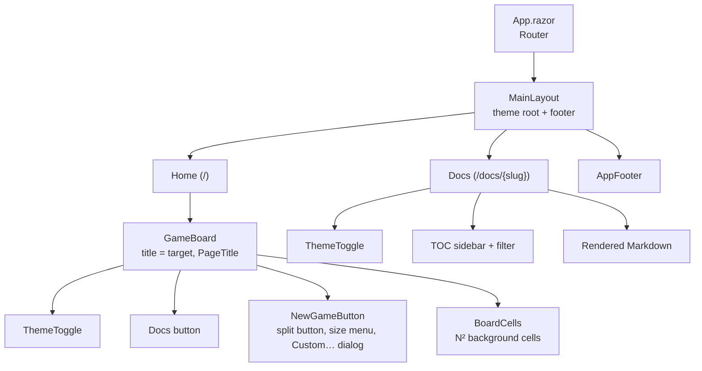

# Architecture

Blazor 2048 is a static **Blazor WebAssembly** app. The .NET runtime, the game engine and the UI all
run in the browser; GitHub Pages only serves files. There is no server code and almost no JavaScript.

## Projects

| Project | Kind | Role |
|---|---|---|
| `src/Game2048.Core` | Class library | Pure C# game rules for N×N boards (`Game`, `BoardSize`). No Blazor or browser dependencies. |
| `src/Blazor2048` | Blazor WebAssembly PWA | Components, theming, docs viewer, service worker. |
| `tools/DocsBuilder` | Console tool (build time only) | Turns the repo's Markdown into HTML for the docs viewer and pre-renders Mermaid diagrams. |
| `tools/PerfTrace` | Console tool (developer only) | Records Chromium traces and per-frame tile samples of the board at any board size, and memory over long sessions. |
| `tests/Blazor2048.Tests` | xUnit v3 | Engine rules at every board size, validation, allocations, tile tracking, docs generator, specs, icons. |
| `tests/Blazor2048.ComponentTests` | xUnit v3 + bUnit | Components rendered in memory. |
| `tests/Blazor2048.E2ETests` | xUnit v3 + Playwright for .NET | The published site in headless Chromium. |

## How the pieces fit

## Runtime view

`Program.cs` registers a handful of services. Everything is scoped, which in WebAssembly means
"one instance for the lifetime of the tab".

| Service | Purpose |
|---|---|
| `Game` | The engine instance. Scoped so a game (and its size) survives a trip to the docs and back. |
| `BrowserStorage` | The only JS interop: `localStorage.getItem` / `setItem`. |
| `BestScoreStore` | Best score per board size (`blazor2048.best.{N}x{N}`; the pre-sizes 4x4 key is migrated), persisted through `BrowserStorage`. |
| `BoardSizeStore` | The last board size chosen (`blazor2048.size`); 4x4 when nothing valid is saved. |
| `ThemeService` | Light / dark / system preference, persisted through `BrowserStorage`. |
| `IDocsSource` | Loads the pre-built docs with `HttpClient` (only when the docs open). |
| `BuildInfo` | Version, runtime, commit and build date for the footer. |

## JavaScript policy

The project is Blazor-first. The only JS interop is two calls to the browser's built-in
`localStorage` API through `IJSRuntime`, in `Services/BrowserStorage.cs`, because WebAssembly has no
other way to reach browser storage. There are no custom `.js` files and no JS libraries.

Things that often need JS were solved in C# or CSS instead:

- **Input:** `@onkeydown` on a focused element, `@ontouchstart` / `@ontouchend` with the swipe
  direction worked out in C#.
- **Menus and dialogs:** the board size menu is the ARIA menu-button pattern in Razor: focus moves
  with `ElementReference.FocusAsync`, click-outside is a transparent backdrop element, and
  `@onkeydown:stopPropagation` keeps menu and dialog keys away from the board.
- **Animations:** CSS transitions on `transform`, driven by tile ids and `@key` (see
  [Theming and animations](theming-and-animations.md)).
- **Theme:** a `data-theme` attribute on a Blazor-rendered element plus CSS `light-dark()`.
- **Docs and diagrams:** Markdown is converted at build time by Markdig and Mermaid diagrams are
  pre-rendered to SVG, so the browser only shows HTML and images (see [Docs system](docs-system.md)).

The only scripts on the page are Blazor's own `blazor.webassembly.js` and the one-line service
worker registration in `index.html`.
