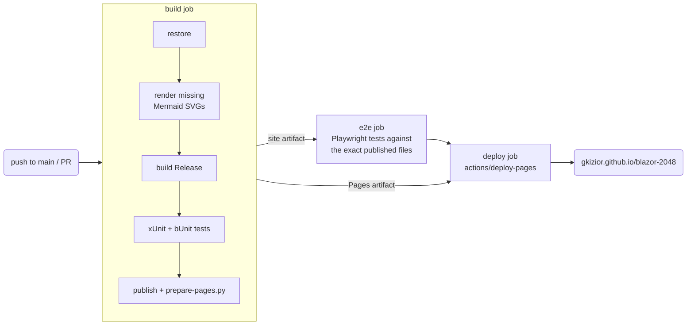
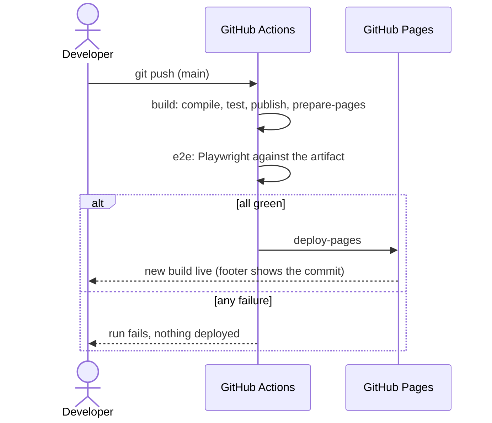

# Build and deploy

## Toolchain

- **.NET 10 SDK** (`global.json`, roll forward to the latest feature band).
- `global.json` also sets `"test": { "runner": "Microsoft.Testing.Platform" }`, which xUnit v3
  needs for `dotnet test` on the .NET 10 SDK.
- **Node 22+** only if you change a Mermaid diagram (see [Docs system](docs-system.md)).

## CI/CD pipeline

`.github/workflows/deploy.yml` runs on every push to `main`, on pull requests (including
Dependabot's), and on demand.



- The **e2e** job downloads the site the build job published, so the files that pass the browser
  tests are the files that get deployed.
- **deploy** needs both jobs and is skipped for pull requests, so PRs (and Dependabot updates) run
  every test but never publish.
- Only the deploy job has `pages: write` / `id-token: write`. The deploy job is the only one in
  the `pages` concurrency group, so a PR run can never cancel a deployment.



## GitHub Pages specifics

`scripts/prepare-pages.py` runs after `dotnet publish`:

- rewrites `<base href="/">` to `/blazor-2048/`, so every relative URL (assets, routes, docs content)
  works under the repo sub-path;
- updates `index.html`'s hash in `service-worker-assets.js` so the offline cache still installs;
- copies `index.html` to `404.html`, so deep links like `/blazor-2048/docs/testing` boot the app;
- adds `.nojekyll` so folders starting with `_` (like `_framework`) are served.

## Offline support

`service-worker.published.js` precaches every file in the publish manifest, including the docs
content and diagram SVGs (`.html`, `.json`, `.svg`). After one visit, the game and the docs work
offline. A new deploy changes the manifest version, and the worker swaps caches on the next visit.

## Build info in the footer

`Blazor2048.csproj` stamps build details into the assembly as `[AssemblyMetadata]`:

| Key | Source |
|---|---|
| `BuildCommit` | `GITHUB_SHA` in CI, otherwise `git rev-parse HEAD`, otherwise `unknown` |
| `BuildDate` | UTC time in CI; the UTC date locally (keeps local builds incremental) |
| `RepositoryUrl` | `$(RepositoryUrl)`, used to link the commit |

`BuildInfo.FromAssembly` reads them at startup, together with `$(Version)` and
`RuntimeInformation.FrameworkDescription` (the .NET runtime running in the browser).

## Dependency updates

`.github/dependabot.yml` checks NuGet packages, GitHub Actions and the .NET SDK weekly
(Mondays 08:00 America/Chicago) and groups minor and patch updates into one PR per ecosystem.
Each PR runs the full test pipeline without deploying.

## Local commands

```bash
dotnet build                                   # also regenerates docs-content
dotnet run --project src/Blazor2048            # dev server
dotnet publish src/Blazor2048 -c Release -o publish
python3 scripts/prepare-pages.py publish/wwwroot /blazor-2048/
```
