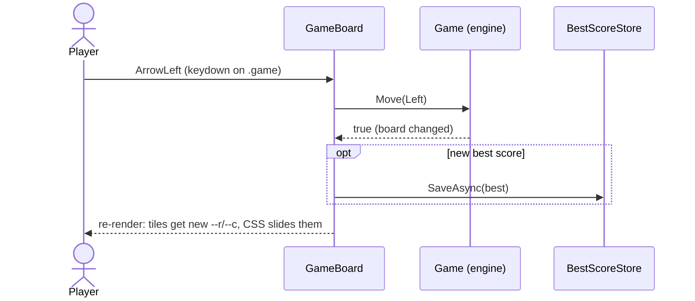

# Components

All UI is Razor components in `src/Blazor2048`. They are small, and each one owns one job.

| Component | File | Job |
|---|---|---|
| `App` | `App.razor` | Router. Unknown URLs fall back to the game. |
| `MainLayout` | `Layout/MainLayout.razor` | Theme root (`data-theme`), `<meta name="theme-color">`, footer. |
| `Home` | `Pages/Home.razor` | Route `/`, hosts `GameBoard`. |
| `GameBoard` | `Components/GameBoard.razor` | The game: header, scores, board, tiles, overlays, input. |
| `BoardCells` | `Components/BoardCells.razor` | The 16 empty background cells; renders once. |
| `ThemeToggle` | `Components/ThemeToggle.razor` | Cycles System → Light → Dark. |
| `AppFooter` | `Components/AppFooter.razor` | Author, version, .NET runtime, commit link, build date. |
| `Docs` | `Pages/Docs.razor` | Routes `/docs` and `/docs/{slug}`: sidebar, content, outline. |
| `Icon` | `Components/Icon.razor` | Inline SVG icons that use `currentColor`. |

## GameBoard



- **Keyboard:** the root `.game` element has `tabindex="0"` and `@onkeydown`. It focuses itself after
  the first render (`ElementReference.FocusAsync`), so arrow keys and WASD work immediately. Key
  events from the header buttons bubble up to it, so clicking a button doesn't break the keys.
- **Touch:** `@ontouchstart` stores the start point, `@ontouchend` computes the direction in C#.
  Movements shorter than 24px are taps, not swipes. `@ontouchmove:preventDefault` and
  `touch-action: none` stop the page from scrolling or bouncing while you play.
- **Rendering:** `BoardCells` draws the sixteen static `.cell` elements once. Tiles are drawn in a
  separate `.tile-layer` from `Game.RenderTiles`, keyed by tile id, with a class fixed for each
  tile's life. `ShouldRender` skips renders when nothing visible changed (no-op moves, other keys,
  the completion of the best-score save). See
  [Theming and animations](theming-and-animations.md#rendering-cost).
- **Overlays:** "Game over!" and "You win!" (with "Keep going") sit above the board.
- **Input is never blocked.** There are no timers or "animation in progress" flags. A move during an
  animation is applied immediately; CSS retargets the tiles from wherever they are.

## ThemeToggle and MainLayout

`ThemeToggle` calls `ThemeService.CycleAsync()`. `MainLayout` subscribes to `ThemeService.Changed`
and re-renders its root:

```html
<div class="app-root theme-dark" data-theme="dark"> ... </div>
```

It also renders `<meta name="theme-color">` through `HeadContent`, so the browser chrome matches
the theme without any JavaScript.

## AppFooter

Reads the `BuildInfo` singleton, which is created from assembly metadata stamped in at build time
(see [Build and deploy](build-and-deploy.md#build-info-in-the-footer)). The short commit SHA links to
the commit on GitHub.

## Docs

A DocFX-style viewer. It loads `docs-content/index.json` once, then each page's pre-rendered HTML on
demand, and renders it as `MarkupString` (the HTML comes from our own build, not from users).

- Left: table of contents grouped by section, with a filter box that matches titles and headings.
- Middle: breadcrumb, content, previous/next links, and a link to the source file on GitHub.
- Right (wide screens): "On this page" outline of `h2`/`h3` headings.
- Narrow screens: the sidebar becomes a slide-in drawer behind a menu button.

Details in [Docs system](docs-system.md).
