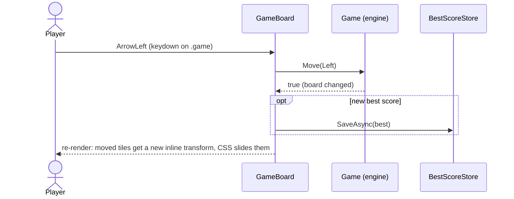
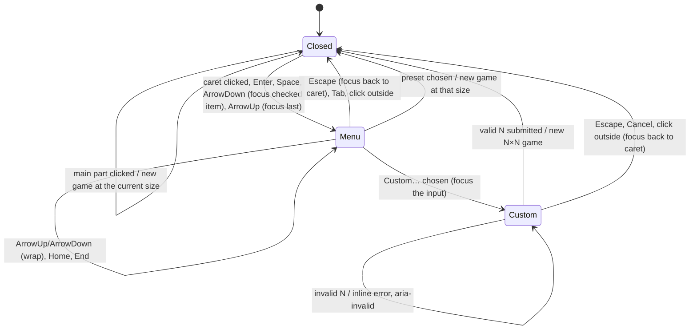

# Components

All UI is Razor components in `src/Blazor2048`. They are small, and each one owns one job.

| Component | File | Job |
|---|---|---|
| `App` | `App.razor` | Router. Unknown URLs fall back to the game. |
| `MainLayout` | `Layout/MainLayout.razor` | Theme root (`data-theme`), `<meta name="theme-color">`, footer. |
| `Home` | `Pages/Home.razor` | Route `/`, hosts `GameBoard`. |
| `GameBoard` | `Components/GameBoard.razor` | The game: header (named after the target), scores, board, tiles, overlays, input, `PageTitle`. |
| `NewGameButton` | `Components/NewGameButton.razor` | Split button: New Game at the current size, a caret with the size menu (4x4…10x10, Custom…) and the custom size dialog. |
| `BoardCells` | `Components/BoardCells.razor` | The N² empty background cells; renders only when the size changes. |
| `ThemeToggle` | `Components/ThemeToggle.razor` | Cycles System → Light → Dark. |
| `AppFooter` | `Components/AppFooter.razor` | Author, version, .NET runtime, commit link, build date. |
| `Docs` | `Pages/Docs.razor` | Routes `/docs` and `/docs/{slug}`: sidebar, content, outline. |
| `Icon` | `Components/Icon.razor` | Inline SVG icons that use `currentColor`. |

## GameBoard



- **Keyboard:** the root `.game` element has `tabindex="0"` and `@onkeydown`. It focuses itself after
  the first render (`ElementReference.FocusAsync`), so arrow keys and WASD work immediately. Key
  events from the header buttons bubble up to it, so clicking a button doesn't break the keys.
- **Touch:** `@ontouchstart` stores the start point, `@ontouchend` computes the direction in C#.
  Movements shorter than 24px are taps, not swipes. `@ontouchmove:preventDefault` and
  `touch-action: none` stop the page from scrolling or bouncing while you play.
- **Rendering:** `BoardCells` draws the N² static `.cell` elements and only re-renders when N
  changes. Tiles are drawn in a separate `.tile-layer` from `Game.RenderTiles`, keyed per tile, with
  a class fixed for each tile's life. Everything a render needs as text is cached: per size (each
  cell's inline transform, the board's style and accessible name, the title) and per tile (class,
  label, `data-*` values), so a render formats no strings. `ShouldRender` skips renders when nothing
  visible changed (no-op moves, other keys, the completion of the best-score save). See
  [Theming and animations](theming-and-animations.md#rendering-cost).
- **Board size:** on first render it loads the saved size (`BoardSizeStore`, 4x4 if none) and the
  best score for that size; the board and title stay hidden until then, so a saved 8x8 never flashes
  4x4 first. Choosing a size starts a new game at that size, saves it, loads that size's best and
  puts focus back on the board.
- **The name easter egg:** the game is named after its target tile, 2^(N+7), so the header title,
  the document title (`<PageTitle>` in `GameBoard`), the hint ("get to 8192!"), the win message
  ("You made 8192!") and the board's accessible name all follow the size. A size change mounts a new
  title `<span>` (keyed by the target), whose `title-flip` animation turns the new number in once.
  Long numbers shrink the title (`--digits`). The static loading screen, `index.html`'s initial
  `<title>`, the manifest, the docs and the repo keep "2048"/"Blazor 2048".
- **Secret tiny boards:** Custom… also takes 1 and 0 (not in the menu, never mentioned by the
  dialog). 1×1 is named 256 and opens with its only tile already 256: "You made 256! One tile,
  zero moves. Speedrun complete." 0×0 is named 128, shows an empty board and says "You won by not
  playing. No tiles, no moves, no regrets." The hint plays along ("Join the tile, get to 256!",
  "No tiles to join, get to 128!"). The win screen waits a beat so the 256 can pop in, and offers
  **Play again** (same tiny board, instant win again) and **Back to N×N** (the last real size).
  The empty board is laid out like a 1×1 board (`--n:1`), so the CSS never divides by zero. Keys
  and swipes do nothing. These boards are **not remembered**: the size is not saved (a reload starts
  the last real size; a hand-edited `blazor2048.size` of 0 or 1 falls back to 4x4) and there is no
  best score (the Best box shows "–", and real sizes' bests are untouched).
- **Overlays:** "Game over!" and "You made {target}!" (with "Keep going") sit above the board; the
  secret tiny boards have their own win screen (above).
- **Paused while choosing:** while the size menu or dialog is open, board keys and swipes are ignored.
- **Input is never blocked.** There are no timers or "animation in progress" flags. A move during an
  animation is applied immediately; CSS retargets the tiles from wherever they are.

## NewGameButton



- **Markup:** the main `button.new-game` (accessible name "New Game, 6 by 6", with a visible `6×6`
  badge) and the caret `#size-menu-button` (`aria-haspopup="menu"`, `aria-expanded`,
  `aria-controls="size-menu"`). The menu is `ul[role=menu]` of `button[role=menuitemradio]` items
  with `aria-checked` and a roving focus (`tabindex="-1"`, focus set in `OnAfterRenderAsync`).
- **Custom…:** a `role="dialog"` with `aria-modal`; the text input (`inputmode="numeric"`) is
  validated by `BoardSize.TryParse` on submit. Errors appear in a `role="alert"` paragraph linked with
  `aria-describedby`, and the input gets `aria-invalid="true"`. A live preview shows "× N".
- **No board moves:** every key handler in the menu and dialog uses `@onkeydown:stopPropagation`,
  and `GameBoard` also ignores moves while `OnOpenChanged` says a menu or dialog is open.
- **Cheap:** `ShouldRender` skips the renders that come from the board's per-move re-render unless
  the size changed (its own events always render), so a move does not re-render the button.

## ThemeToggle and MainLayout

`ThemeToggle` calls `ThemeService.CycleAsync()`. `MainLayout` subscribes to `ThemeService.Changed`
and re-renders its root:

```html
<div class="app-root theme-dark" data-theme="dark"> ... </div>
```

It also renders `<meta name="theme-color">` through `HeadContent`, so the browser chrome matches
the theme without any JavaScript.

## AppFooter

Reads the `BuildInfo` singleton, which is created from assembly metadata stamped in at build time
(see [Build and deploy](build-and-deploy.md#build-info-in-the-footer)). The short commit SHA links to
the commit on GitHub.

## Docs

A DocFX-style viewer. It loads `docs-content/index.json` once, then each page's pre-rendered HTML on
demand, and renders it as `MarkupString` (the HTML comes from our own build, not from users).

- Left: table of contents grouped by section, with a filter box that matches titles and headings.
- Middle: breadcrumb, content, previous/next links, and a link to the source file on GitHub.
- Right (wide screens): "On this page" outline of `h2`/`h3` headings.
- Narrow screens: the sidebar becomes a slide-in drawer behind a menu button.

Details in [Docs system](docs-system.md).
