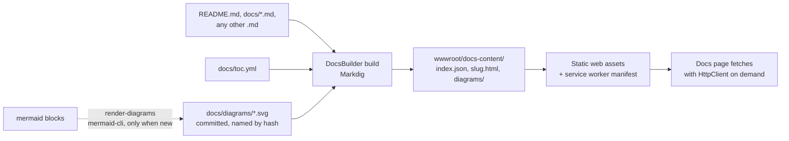

# Docs system

The docs you are reading are the repo's own Markdown files, turned into HTML **at build time** and
shown by a Blazor page. The browser never parses Markdown and never runs Mermaid.

## Pipeline



1. `Blazor2048.csproj` builds `tools/DocsBuilder` (a project reference with
   `ReferenceOutputAssembly="false"`) and runs `DocsBuilder build` before the app build.
   It is incremental: it only runs when a `.md` file, `toc.yml`, a diagram, or the tool changes.
2. DocsBuilder finds **every `.md` file in the repo** (skipping `bin`, `obj`, `node_modules`, ...),
   orders them by `docs/toc.yml`, and puts anything not listed under **More**.
3. Each file is parsed with [Markdig](https://github.com/xoofx/markdig) (advanced extensions: tables,
   task lists, GitHub-style heading ids, ...). The renderer then:
   - replaces each ` ```mermaid ` block with a `<figure>` holding a light and a dark ``;
   - rewrites links between Markdown files to app routes (`docs/{slug}#heading`), which work under
     the `/blazor-2048/` base path;
   - points other repo-relative links at the file on GitHub;
   - collects `h2`/`h3` headings for the "On this page" outline.
4. Output goes to `wwwroot/docs-content/` (git-ignored), so it becomes part of the app's static
   assets and the PWA's offline cache like any other file.

## Mermaid without runtime JavaScript

Two options were considered:

| | Mermaid JS in the browser | Pre-rendered SVG (chosen) |
|---|---|---|
| JavaScript at runtime | ~3 MB library + interop to call it | None |
| First docs view | Download + parse + render diagrams | Plain `` |
| Offline | Library must be precached for everyone | Small SVGs, cached with the docs |
| Dark mode | Re-render on every theme change | Two SVGs, CSS picks one |
| Authoring cost | None | Run one command when a diagram changes (CI also does it) |

Pre-rendering won: it keeps the app free of JS libraries (the project rule), is faster, and works
offline. The cost is a Node-based tool at authoring/CI time only.

### How diagrams are rendered

```bash
dotnet run --project tools/DocsBuilder -- render-diagrams --repo .
```

- Each diagram's file name is a hash of its source plus the renderer settings, e.g.
  `docs/diagrams/1a2b3c4d5e6f-light.svg` and `-dark.svg`. Unchanged diagrams are never re-rendered,
  and SVGs no doc uses any more are deleted.
- Rendering uses the official [mermaid-cli](https://github.com/mermaid-js/mermaid-cli) through `npx`
  (pinned version, Node 22+), with palettes that match the app's light and dark themes, a
  cross-platform font stack, and no embedded fonts (SVGs stay around 10-20 KB).
- The SVGs are committed, so a normal `dotnet build` never needs Node.
- CI runs the same command before building, so a diagram edited without re-rendering still ships
  as a picture. If an SVG is missing at build time, the docs show the diagram source instead and the
  build prints a `DOCS001` warning.
- Add an `accTitle:` line to a diagram to give its image a meaningful alt text.

## Adding a doc

1. Create `docs/my-topic.md` with a `# Title`.
2. Add it to `docs/toc.yml` under a section (optional: unlisted files appear under **More**).
3. If it has Mermaid blocks, run `render-diagrams` and commit the new SVGs.
4. `dotnet build` and open `/docs/my-topic`.
