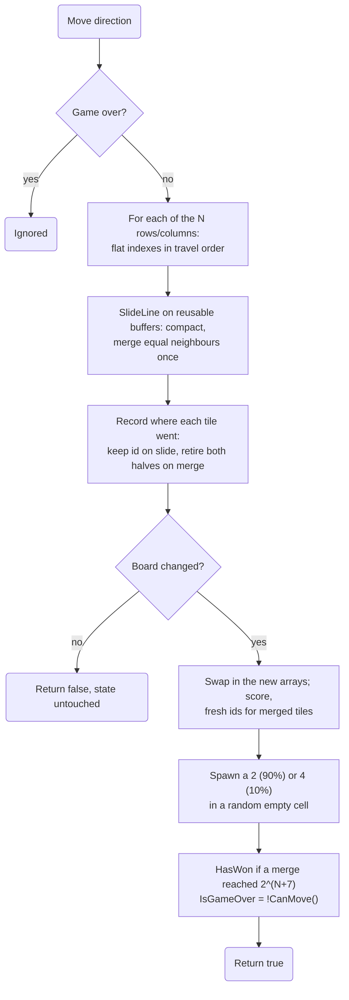
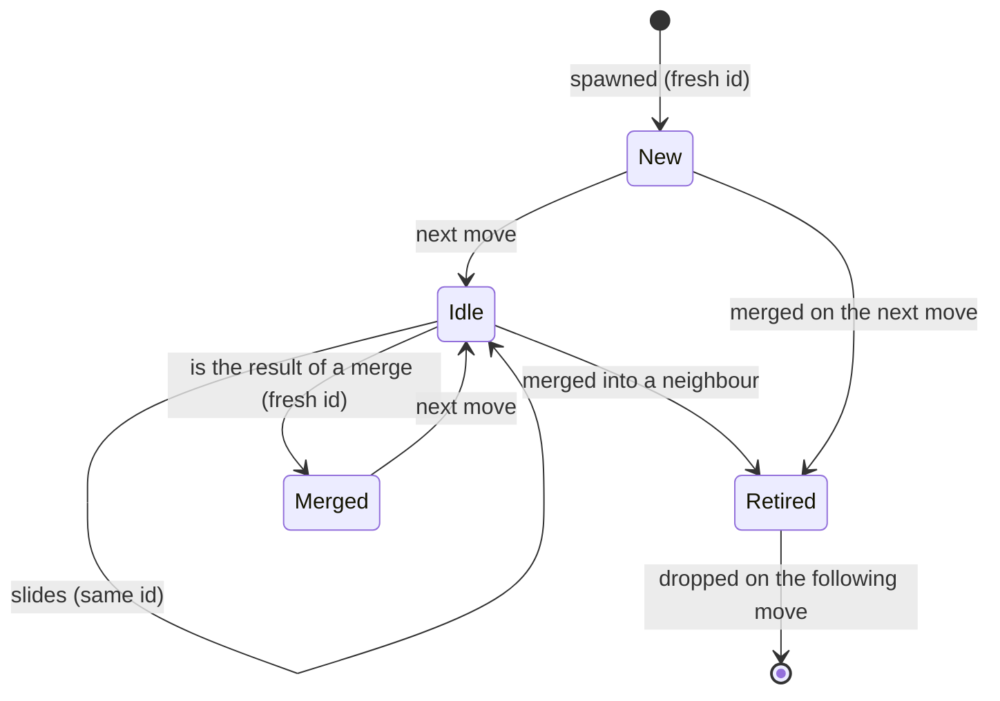

# Game engine

All rules live in `src/Game2048.Core/Game.cs` and `BoardSize.cs`, plain C# with no UI dependencies,
so they can be unit tested directly and reused by any front end.

## Board sizes

Boards are always square, N×N ([spec 011](../specs/011-board-sizes/spec.md)). `BoardSize` holds the
rules:

| Member | Value |
|---|---|
| `Min` / `Max` | 2 and 16: the playable range (16 is the measured limit, see below) |
| `IsValid(n)` | 2…16: what is saved as the last size and gets a best score |
| `IsSecret(n)` | 0 and 1: the secret instant-win boards (see below) |
| `IsSupported(n)` | `IsValid` or `IsSecret`: any size a `Game` can start |
| `Default` | 4 (the classic board, used when nothing is saved) |
| `Presets` | 4…10, the sizes in the New Game menu |
| `TryParse(text, out size, out error)` | Validates the Custom… input: whole numbers 0…16, with a message for empty, negatives, too big, decimals and non-numbers (the messages only ever mention 2 to 16) |
| `WinningTile(n)` | The target, 2^(N+7): 128 (0×0), 256 (1×1), 512 (2×2), 1024 (3×3), **2048 (4×4)**, 4096 … 131072 (10×10) … 8388608 (16×16) |

The target is also the game's "name": the UI shows it wherever the classic game says 2048 (the easter
egg). 2^(N+7) fits an `int` up to N = 23, so `WinningTile` cannot overflow at `Max`. A 2×2 board
can never reach its 512 (its largest possible tile is 32) and 1024 is the largest tile a 3×3 board can
hold, which is part of the joke.

### Secret sizes: 1×1 and 0×0

The original request ruled out "1x1 tho or 0 or neg"; a later one reversed that for 1 and 0 only:
"It would be funny to allow size of 1 and 0. Where you just win right away"
([spec 011, User Story 7](../specs/011-board-sizes/spec.md)). Custom… accepts them, the menu
doesn't list them and the messages never mention them.

- `NewGame()` on a 1×1 board puts one tile in the only cell with the target value, 256, flagged
  new so it pops in. On 0×0 there is nothing at all. In both cases `HasWon` and `IsGameOver` are
  set at once, nothing spawns, and `IsInstantWin` is true.
- Nothing divides by N or indexes an empty array: the flat arrays and line buffers simply have length
  0 or 1, `Move` returns false (the game is over), `CanMove` and `AddRandomTile` return false, and
  `Tiles`/`RenderTiles` are empty (0×0) or hold the single tile (1×1). `Continue()` does nothing,
  since there is nothing to continue.
- Negatives (including `-0`), decimals such as `1.5`, and text are still rejected.

Why 16: the tile labels on a 390 px wide phone are the limit, not speed. Cells are about 26 px at
12×12, 19.5 px at 16×16 and 15.6 px at 20×20; with compact labels (`16K`) 16×16 is still readable,
20×20 is not. Performance at 16×16 after the optimizations below is within the spec's budget of 4×4
(numbers in the [plan](../specs/011-board-sizes/plan.md)).

## State

| Member | Meaning |
|---|---|
| `Size` | N for an N×N board. `NewGame(n)` changes it. |
| `this[row, col]` | The value at a cell, `0` for empty. |
| `Board` | A copy of the board as `int[N, N]` (for tests and tools; it allocates). |
| `Score` | Sum of every merged tile's value. |
| `WinningTile` | The target for this size (see above). |
| `HasWon` / `KeepPlaying` | Reached the target / chose "Keep going". |
| `IsInstantWin` | A secret 1×1 or 0×0 board: won and over before the first move. |
| `IsGameOver` | No empty cells and no equal neighbours. |
| `Tiles` | Live tiles with stable ids, ordered by id (a new list; for tests). |
| `RetiredTiles` | Tiles merged away by the last move, positioned on their merge target. |
| `RenderTiles` | `RetiredTiles` + live tiles, ordered by id. This is what the board draws; one reused list. |
| `SpawnedCell` | Where the last random tile went. |

## Memory layout

Big boards made the engine's data structures matter, so a move allocates nothing:

- Values, tile ids and per-cell flags (new / merged) are **flat arrays** indexed `row * N + col`.
- A move reads each line into **reusable line buffers** (`_lineIndex`, `_lineValues`, …, length N),
  runs `SlideLine` on spans, and writes into a **second set of arrays** that is swapped in when the
  board changed. Nothing is copied back.
- Retired tiles and the render list are two `List<Tile>` that are cleared and refilled; `Tile` is a
  `readonly record struct`, so filling them does not allocate. The render list is rebuilt lazily,
  once per change, and sorted in place with a cached comparison.
- `AddRandomTile` counts empty cells and picks the k-th one (no list of empty cells); `CanMove` and the
  win check run over the flat array (no LINQ).
- Buffers are allocated only by `NewGame(n)` when N changes, and capacity grown for a big board is
  trimmed when switching back down.

`AllSizesTests.Moves_And_The_Render_List_Do_Not_Allocate` measures it with
`GC.GetAllocatedBytesForCurrentThread()`: under one byte per move on 4×4, 10×10 and the largest
board. The first, straightforward generalization (`int[,]`, LINQ, per-line arrays and lists) allocated
3.7 KB per move on 4×4, 12.5 KB on 10×10 and 25.6 KB on 16×16, and was 3–5 times slower (a move plus
building the render list, .NET 10 JIT: 10.3 → 1.4 µs on 4×4, 10.1 → 3.0 µs on 16×16).

## A move

Every move is reduced to the same one-dimensional problem: slide one line toward index 0.
`FillLineIndex` lists a row or column's flat indexes in the order tiles travel, so **left, right, up
and down share one implementation**, at any N.

### Merge rules

`SlideLine` (spans, no allocation; used by moves) and `SlideRow` (arrays; used by tests) implement
the classic rules, for lines of any length:

- Tiles slide as far as they can toward the edge.
- Two equal tiles merge into one with double the value, and the score grows by that value.
- **A tile merges at most once per move**, so `[2, 2, 2, 2]` becomes `[4, 4, 0, 0]`, not `[8, 0, 0, 0]`.
- Merges are resolved from the edge the tiles move toward: `[2, 2, 2, 0]` moving left gives `[4, 2, 0, 0]`.

## Tile identity (for animations)

The UI animates by tile **id**, so the engine tracks where every tile goes:

- A tile that slides **keeps its id**, so its DOM element is reused and CSS can transition it.
- A merge **retires both source tiles** (they slide onto the target cell) and creates a **new tile**
  with a new id, so its "pop" animation plays exactly once.
- Ids only increase. Rendering in id order means a keyed list never reorders existing elements,
  which would cancel their transitions.
- A move that changes nothing returns `false` and leaves all state (including animation flags)
  untouched.

## Randomness and testing

The constructor takes an optional `Random`, so tests use a seeded instance and get the same tiles
every run. `SetBoard` loads an exact position for scenario tests. See [Testing strategy](testing.md).
