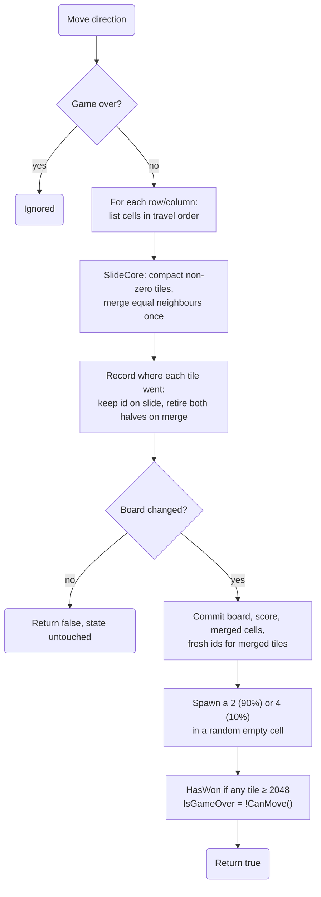
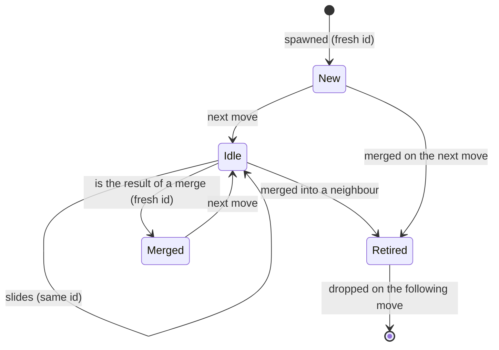

# Game engine

All rules live in `src/Game2048.Core/Game.cs`, a plain C# class with no UI dependencies, so it can be
unit tested directly and reused by any front end.

## State

| Member | Meaning |
|---|---|
| `Board` | `int[size, size]`, `0` for empty cells. |
| `Score` | Sum of every merged tile's value. |
| `HasWon` / `KeepPlaying` | Reached 2048 / chose "Keep going". |
| `IsGameOver` | No empty cells and no equal neighbours. |
| `Tiles` | Live tiles with stable ids, ordered by id. |
| `RetiredTiles` | Tiles merged away by the last move, positioned on their merge target. |
| `RenderTiles` | `RetiredTiles` + `Tiles`, ordered by id. This is what the board draws. |
| `MergedCells`, `SpawnedCells` | Cells changed by the last move (drive the pop and spawn animations). |

## A move

Every move is reduced to the same one-dimensional problem: slide one line toward index 0.
`LineCells` lists a row or column in the order tiles travel, so **left, right, up and down share one
implementation**.

### Merge rules

`SlideRow` (public, used by tests) and the private `SlideCore` implement the classic rules:

- Tiles slide as far as they can toward the edge.
- Two equal tiles merge into one with double the value, and the score grows by that value.
- **A tile merges at most once per move**, so `[2, 2, 2, 2]` becomes `[4, 4, 0, 0]`, not `[8, 0, 0, 0]`.
- Merges are resolved from the edge the tiles move toward: `[2, 2, 2, 0]` moving left gives `[4, 2, 0, 0]`.

## Tile identity (for animations)

The UI animates by tile **id**, so the engine tracks where every tile goes:

- A tile that slides **keeps its id**, so its DOM element is reused and CSS can transition it.
- A merge **retires both source tiles** (they slide onto the target cell) and creates a **new tile**
  with a new id, so its "pop" animation plays exactly once.
- Ids only increase. Rendering in id order means a keyed list never reorders existing elements,
  which would cancel their transitions.
- A move that changes nothing returns `false` and leaves all state (including animation flags)
  untouched.

## Randomness and testing

The constructor takes an optional `Random`, so tests use a seeded instance and get the same tiles
every run. `SetBoard` loads an exact position for scenario tests. See [Testing strategy](testing.md).
