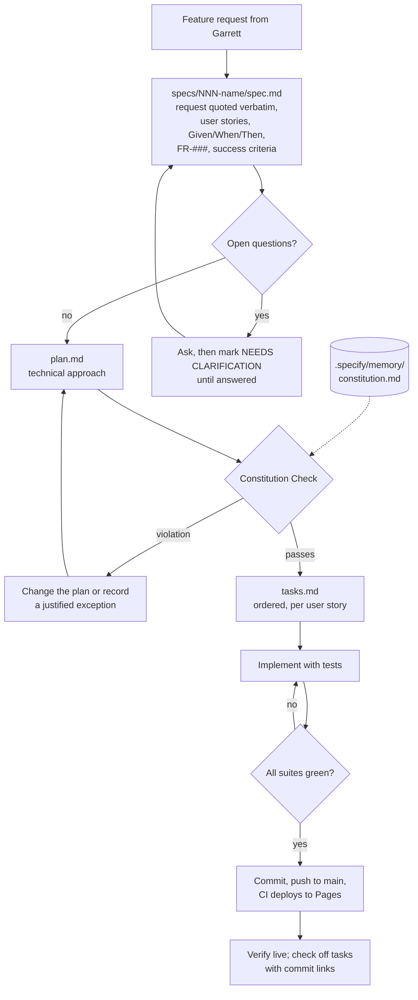

# Spec-driven development

Every feature in this repo starts as a written spec. The layout mirrors
[GitHub Spec Kit](https://github.com/github/spec-kit), but everything is plain Markdown maintained
by hand: no Copilot and no `specify` CLI.

## Layout

| Path | What it holds |
|---|---|
| [`.specify/memory/constitution.md`](../.specify/memory/constitution.md) | The project's principles, quality gates and governance. Every plan is checked against it. |
| [`.specify/templates/spec-template.md`](../.specify/templates/spec-template.md) | What and why: the original request (verbatim, with source and date), user stories with Given/When/Then scenarios, `FR-###` requirements, success criteria. No implementation details. |
| [`.specify/templates/plan-template.md`](../.specify/templates/plan-template.md) | How: technical context, Constitution Check, design (with Mermaid), project structure, exceptions. |
| [`.specify/templates/tasks-template.md`](../.specify/templates/tasks-template.md) | Ordered tasks by user story; each checked task links to its commit. |
| `specs/NNN-feature-name/` | One folder per feature: `spec.md`, `plan.md`, `tasks.md`. |

## Workflow

1. **Specify.** Create the next `specs/NNN-feature-name/` folder from the templates. Quote the
   request word for word with its source and date. If the exact wording was not kept, say so and
   summarize; never invent a quote.
2. **Plan.** Describe what will be built and fill in the Constitution Check. Anything that bends a
   principle goes in the Complexity Tracking table with the reason.
3. **Tasks.** Break the plan into small tasks grouped by user story, tests included.
4. **Implement.** Work through the tasks. Check each one off with a link to its commit.
5. **Ship.** All suites green, push to `main`, confirm the Pages deploy and the live footer commit.

Changes to an existing feature update its spec (a "Revision" in the Original Request section, new
scenarios and requirements) instead of starting a new folder, unless the change is a feature of its
own. [004](../specs/004-fluid-animations/spec.md) is an example.

`SpecsTests` (in `tests/Blazor2048.Tests`) fails the build if a spec folder is missing one of the
three files, is misnamed, lacks the required sections, or is missing from the docs sidebar.

## Specs

| # | Feature | Spec | Plan | Tasks |
|---|---|---|---|---|
| 001 | Core game | [spec](../specs/001-core-game/spec.md) | [plan](../specs/001-core-game/plan.md) | [tasks](../specs/001-core-game/tasks.md) |
| 002 | Blazor first, minimal interop | [spec](../specs/002-blazor-first-minimal-interop/spec.md) | [plan](../specs/002-blazor-first-minimal-interop/plan.md) | [tasks](../specs/002-blazor-first-minimal-interop/tasks.md) |
| 003 | Dark mode and palette | [spec](../specs/003-dark-mode-and-palette/spec.md) | [plan](../specs/003-dark-mode-and-palette/plan.md) | [tasks](../specs/003-dark-mode-and-palette/tasks.md) |
| 004 | Fluid animations | [spec](../specs/004-fluid-animations/spec.md) | [plan](../specs/004-fluid-animations/plan.md) | [tasks](../specs/004-fluid-animations/tasks.md) |
| 005 | Build-info footer | [spec](../specs/005-build-info-footer/spec.md) | [plan](../specs/005-build-info-footer/plan.md) | [tasks](../specs/005-build-info-footer/tasks.md) |
| 006 | In-app docs with Mermaid | [spec](../specs/006-in-app-docs/spec.md) | [plan](../specs/006-in-app-docs/plan.md) | [tasks](../specs/006-in-app-docs/tasks.md) |
| 007 | Testing stack | [spec](../specs/007-testing-stack/spec.md) | [plan](../specs/007-testing-stack/plan.md) | [tasks](../specs/007-testing-stack/tasks.md) |
| 008 | Dependency policy and Dependabot | [spec](../specs/008-dependency-policy/spec.md) | [plan](../specs/008-dependency-policy/plan.md) | [tasks](../specs/008-dependency-policy/tasks.md) |
| 009 | Repo metadata and social image | [spec](../specs/009-repo-metadata-and-social-image/spec.md) | [plan](../specs/009-repo-metadata-and-social-image/plan.md) | [tasks](../specs/009-repo-metadata-and-social-image/tasks.md) |
| 010 | Spec-driven development | [spec](../specs/010-spec-driven-development/spec.md) | [plan](../specs/010-spec-driven-development/plan.md) | [tasks](../specs/010-spec-driven-development/tasks.md) |

Specs 001–009 were written after the features were built, from the commit history and the requests
as they were relayed. Where a request's exact wording was not kept, the spec says so.
