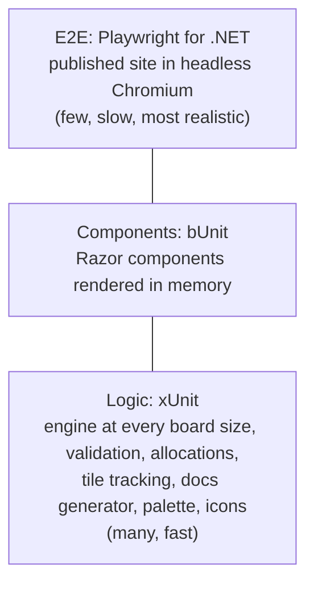

# Testing strategy

Three test projects, three levels. All use **xUnit v3** (`xunit.v3`) and run on
**Microsoft.Testing.Platform**, which `global.json` turns on for `dotnet test`.



## Logic tests: `tests/Blazor2048.Tests`

Plain xUnit tests with no UI.

- **Rules:** `SlideRow` theory data covers merges, gaps, and the "merge once" rule; scenario tests
  load exact boards with `SetBoard` and check each direction, spawning, winning and game over.
- **Tile tracking:** ids survive slides, merges retire both halves onto the target and create a new
  id, spawns are flagged, ids stay unique and ordered across many random moves.
- **Every board size** (`AllSizesTests`, theory data 2…`BoardSize.Max`): a new game has two tiles,
  a full line merges pairwise in all four directions, a checkerboard is game over and one pair
  un-blocks it, the target 2^(N+7) wins and half of it doesn't. A property-style test plays 400
  seeded random moves per size and checks each one against a reference implementation (the obvious
  2D-array version built on `SlideRow`): same board except exactly one spawned 2 or 4 on an empty
  cell, score grows by the merged values, ids unique and in order, one live tile per non-empty cell.
- **Allocations:** after a warm-up, 2000 moves plus reading `RenderTiles` allocate under one byte
  per move on 4x4, 10x10 and the largest board (`GC.GetAllocatedBytesForCurrentThread()`).
- **Validation** (`BoardSizeTests`): `BoardSize.TryParse` accepts whole numbers 2…Max (spaces,
  leading zeros, `+5`) and the secret 1, and rejects 0 (`0`, `00`), negatives (`-1`, `-0`), decimals
  (`1.5`, `7.5`, `6,5`), words, empty input and huge numbers, each with a message that names the
  allowed range (2 to 16); the targets 256…131072; no overflow at the largest size; 1 is the only
  secret size and is not a preset.
- **The 1×1 board** (`SecretSizesTests`): one 256 tile, already won and over; no move changes
  anything or throws; `Continue` is a no-op; replaying gives the tile a new id; switching to and
  from real sizes; `SetBoard` on 1×1; no 0×0 board (the engine throws, `TryParse` rejects it).
- **Icons** (`AppIconTests`): every manifest icon exists at its declared size, the maskable icons
  are declared, `favicon.ico` holds 16/32/48 px images, and the service worker cache has a revision.
- **Docs generator:** Markdown to HTML, Mermaid blocks to `` pairs, link rewriting, headings,
  and that every doc in the repo is in the index.
- **Palette:** parses `app.css` and checks every tile's text/background contrast is at least 4.5:1.

## Component tests: `tests/Blazor2048.ComponentTests`

[bUnit](https://bunit.dev) renders components without a browser. Test classes derive from
`BunitContext`, register services, and use `Render<T>()`. JS interop runs in loose mode, so
`localStorage` calls return defaults and can be verified or stubbed with `JSInterop.Setup`.

Covered: board rendering and tile classes, keys and swipes, New Game, win/lose overlays, best score
loading, the theme toggle cycling and setting `data-theme` on the layout root, theme persistence,
the footer's name and build info, the docs button, and the docs page (TOC, filter, rendered
Markdown, diagrams, not-found) with a fake `IDocsSource`.

Board sizes (`BoardSizeUiTests`): the split button's ARIA attributes; the menu's items, checked
state and roving focus (which element `FocusAsync` targeted is checked against the `@ref` ids bUnit
prints); ArrowUp/ArrowDown wrapping, Home/End, Escape returning focus to the caret, Tab and the
backdrop closing it; board keys ignored while the menu or dialog is open; the Custom… dialog's
inline errors (`role="alert"`, `aria-invalid`, `aria-describedby`) for -1, -5, `abc`, `1.5`, `7.5`,
empty and too big, and a valid 12; Cancel/Escape; the saved size restored and invalid saved sizes falling
back to 4x4; best scores per size and the legacy 4x4 key migrated; the name easter egg (title,
`PageTitle`, hint, accessible name, win message per size, the flip only on a size change); compact
labels; that moves re-render neither the button nor the cells; and that a best score read that
completes late (a pending interop result) still shows.

The 1×1 board (`SecretSizesUiTests`): from Custom… (tile, cells, title, `PageTitle`, hint,
accessible name, the win screen's wording and buttons, no "Keep going", no "Game over!"); 0
rejected inline; keys and swipes do nothing; not saved and no best; Play again, the main button and
Back to N×N; the menu still lists only the presets and the dialog still says 2 to 16; a saved 1 or 0
is never restored.

## End-to-end tests: `tests/Blazor2048.E2ETests`

[Playwright for .NET](https://playwright.dev/dotnet/) with `Microsoft.Playwright.Xunit.v3`:

- An xUnit v3 **assembly fixture** (`SiteServer`) serves the published `wwwroot` with Kestrel under
  the same base path as GitHub Pages, including a `404.html` fallback for deep links.
- Test classes derive from `AppTest`, which extends Playwright's `BrowserTest` (browser lifecycle,
  `BROWSER`/`HEADED` environment variables) and adds `OpenAsync()`.
- Tests: app loads and focuses the board; arrow keys move tiles; the layout fits iPhone screens;
  dark mode persists across a reload; docs open and show a rendered Mermaid diagram; rapid key
  presses during animations are all applied; no console errors.
- `BoardSizeE2ETests`: every preset (cells, title, tab title, hint, fits a 1280x800 window, focus
  back on the board); the menu from the keyboard; click-outside; a custom 12x12; invalid custom input
  rejected inline; the size and the per-size best surviving a reload; rapid input on a filled 10x10
  board with no teleports or snaps; and a 10x10 board on a 390x844 phone that fits, has cells of at
  least 24 px and moves on real touch swipes (CDP `Input.dispatchTouchEvent`). The secret 1x1 board
  wins at once with a 256 tile, ignores keys and is not restored by a reload (back to 6x6); on a
  phone, 0 is rejected, then 1x1 fits, ignores real swipes and keys, and "Back to 4×4" returns to a
  real game.
  Invalid input includes `0`, `-1` and `1.5`.
- `AnimationE2ETests` samples every tile's box and opacity once per frame (a test-side
  `requestAnimationFrame` loop; the app ships no such code) and asserts that merge sources reach
  the target before they are removed, the merged tile stays invisible until they arrive, rapid
  input never snaps a spawn/pop animation, and retargeted slides never jump.

E2E tests are opt-in locally because they need a browser:

```bash
# once: install Chromium for Playwright
pwsh tests/Blazor2048.E2ETests/bin/Debug/net10.0/playwright.ps1 install chromium
RUN_E2E=1 dotnet test --project tests/Blazor2048.E2ETests
```

Set `E2E_SITE_DIR` to test an existing publish folder (CI does this with the exact files it deploys).

## Animation performance

`tools/PerfTrace` is a developer tool for measuring how the board animates, at any board size, and
memory over long sessions. It
drives a published site with Playwright for .NET and, for desktop, desktop with 4x CPU throttling
and a 390x844 mobile viewport with 4x throttling, at two input paces (a key every 50 ms and every
250 ms), it records:

- a **Chromium performance trace** over CDP (`Tracing.start`), saved as `*.trace.json` and
  loadable in DevTools' Performance panel. From it: compositor frames dropped or presented
  (`PipelineReporter`), script time per keydown (Blazor's event handling, render and DOM patch),
  style, layout and paint time per move, and long tasks;
- input-to-DOM latency (keydown to the first mutation of the tile layer) and **key-to-paint**
  (keydown to the start of the frame that paints the change: the first mutation schedules one
  `requestAnimationFrame`);
- a per-frame sample of every tile, used to count visual glitches: merge sources removed before
  arriving, merged tiles visible before their sources land, scale animations cut short, and
  slides that jump instead of animating.

```bash
dotnet publish src/Blazor2048 -c Release -o /tmp/site
python3 scripts/prepare-pages.py /tmp/site/wwwroot /blazor-2048/
# serve /tmp/site/wwwroot under /blazor-2048/ (any static server), then:
dotnet run --project tools/PerfTrace -c Release -- --url http://127.0.0.1:8765/blazor-2048/ --label local --out perf-results
dotnet run --project tools/PerfTrace -c Release -- --url https://gkizior.github.io/blazor-2048/ --label live --out perf-results
```

Options: `--runs N` (default 2), `--moves N` (default 24), `--profiles desktop,desktop-4x,mobile-4x`,
`--paces rapid,paced`, and `--sizes 4,10,16` (default 4). For each size it seeds the app's saved
size (`blazor2048.size`) before the page loads, then makes size² unthrottled warm-up moves that
alternate left and right (row merges only, so tiles pile up) before measuring, so a big board is
measured with dozens of tiles. The table has a size and a tiles column.

`--memory` plays `--memory-moves` moves (default 600; a game over starts a new game) and then
`--memory-games` new games (default 50) per size and profile, and samples, after a forced garbage
collection (CDP `HeapProfiler.collectGarbage`), the JS heap and DOM node count
(`Performance.getMetrics`) and the WebAssembly linear memory (`getDotnetRuntime(0).Module.HEAPU8.length`)
every 50 moves and every 10 new games.

```bash
dotnet run --project tools/PerfTrace -c Release -- --url http://127.0.0.1:8765/blazor-2048/ --label sizes --out perf-results --runs 1 --paces rapid --sizes 4,6,8,10,16
dotnet run --project tools/PerfTrace -c Release -- --url http://127.0.0.1:8765/blazor-2048/ --label sizes --out perf-results --memory --profiles desktop --sizes 4,10,16
```

It prints a Markdown table and writes `<label>.json` plus the traces to `--out` (`perf-results/`
is git-ignored). It uses the same Playwright Chromium install as the E2E tests. CI builds it with the solution so it keeps compiling, but never runs it:
the numbers depend on the machine, so compare runs from the same machine only.
[Theming and animations](theming-and-animations.md#why-it-felt-choppy-and-how-it-was-measured)
has the findings that led to the current animation design, and
[spec 011's plan](../specs/011-board-sizes/plan.md#measurements) the board size measurements.

## Running everything

```bash
dotnet test                       # logic + bUnit (E2E tests report as skipped)
RUN_E2E=1 dotnet test             # everything
```
