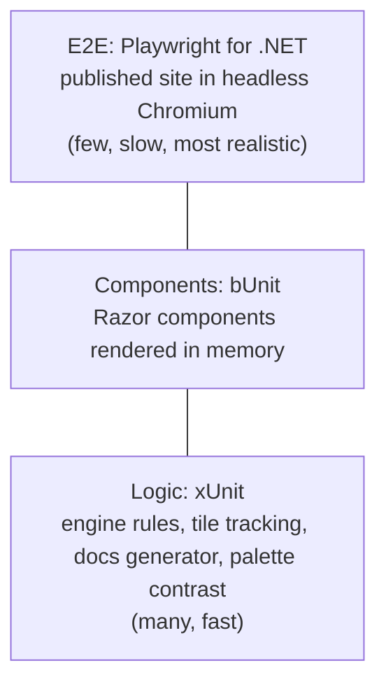

# Testing strategy

Three test projects, three levels. All use **xUnit v3** (`xunit.v3`) and run on
**Microsoft.Testing.Platform**, which `global.json` turns on for `dotnet test`.



## Logic tests: `tests/Blazor2048.Tests`

Plain xUnit tests with no UI.

- **Rules:** `SlideRow` theory data covers merges, gaps, and the "merge once" rule; scenario tests
  load exact boards with `SetBoard` and check each direction, spawning, winning and game over.
- **Tile tracking:** ids survive slides, merges retire both halves onto the target and create a new
  id, spawns are flagged, ids stay unique and ordered across many random moves.
- **Docs generator:** Markdown to HTML, Mermaid blocks to `` pairs, link rewriting, headings,
  and that every doc in the repo is in the index.
- **Palette:** parses `app.css` and checks every tile's text/background contrast is at least 4.5:1.

## Component tests: `tests/Blazor2048.ComponentTests`

[bUnit](https://bunit.dev) renders components without a browser. Test classes derive from
`BunitContext`, register services, and use `Render<T>()`. JS interop runs in loose mode, so
`localStorage` calls return defaults and can be verified or stubbed with `JSInterop.Setup`.

Covered: board rendering and tile classes, keys and swipes, New Game, win/lose overlays, best score
loading, the theme toggle cycling and setting `data-theme` on the layout root, theme persistence,
the footer's name and build info, the docs button, and the docs page (TOC, filter, rendered
Markdown, diagrams, not-found) with a fake `IDocsSource`.

## End-to-end tests: `tests/Blazor2048.E2ETests`

[Playwright for .NET](https://playwright.dev/dotnet/) with `Microsoft.Playwright.Xunit.v3`:

- An xUnit v3 **assembly fixture** (`SiteServer`) serves the published `wwwroot` with Kestrel under
  the same base path as GitHub Pages, including a `404.html` fallback for deep links.
- Test classes derive from `AppTest`, which extends Playwright's `BrowserTest` (browser lifecycle,
  `BROWSER`/`HEADED` environment variables) and adds `OpenAsync()`.
- Tests: app loads and focuses the board; arrow keys move tiles; the layout fits iPhone screens;
  dark mode persists across a reload; docs open and show a rendered Mermaid diagram; rapid key
  presses during animations are all applied; no console errors.

E2E tests are opt-in locally because they need a browser:

```bash
# once: install Chromium for Playwright
pwsh tests/Blazor2048.E2ETests/bin/Debug/net10.0/playwright.ps1 install chromium
RUN_E2E=1 dotnet test --project tests/Blazor2048.E2ETests
```

Set `E2E_SITE_DIR` to test an existing publish folder (CI does this with the exact files it deploys).

## Running everything

```bash
dotnet test                       # logic + bUnit (E2E tests report as skipped)
RUN_E2E=1 dotnet test             # everything
```
