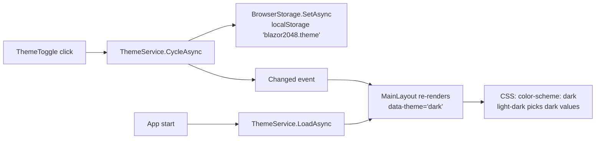
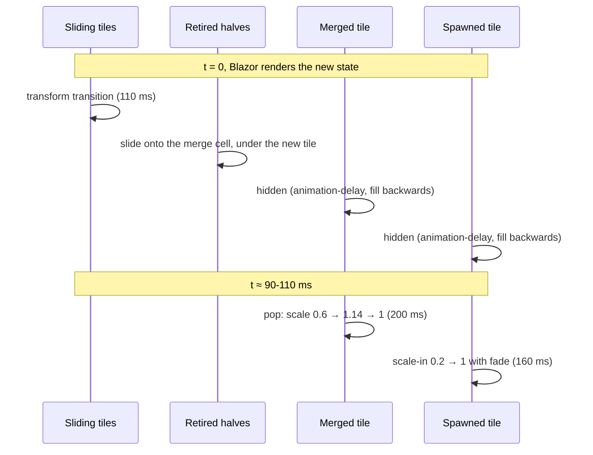

# Theming and animations

Both features are pure CSS driven by state that Blazor renders. Neither uses JavaScript.

## Theme tokens

Every color in `wwwroot/css/app.css` is a CSS custom property defined once on `:root` with
[`light-dark()`](https://developer.mozilla.org/docs/Web/CSS/color_value/light-dark):

```css
:root {
    color-scheme: light dark;
    --bg:   light-dark(#f6f3ee, #121318);
    --text: light-dark(#3b3631, #eceef3);
}
.app-root[data-theme="light"] { color-scheme: light; }
.app-root[data-theme="dark"]  { color-scheme: dark; }
```

`light-dark()` picks a value from the `color-scheme` of the element that uses it. `:root` says
`light dark` (follow the OS), and `MainLayout` renders `data-theme` on `.app-root` to pin a choice.
So **System** needs no extra CSS at all: `prefers-color-scheme` is applied by the browser.



The preference is stored with the same `BrowserStorage` helper as the best score (key
`blazor2048.theme`, values `system`, `light`, `dark`).

### Palette and contrast

Tiles run from warm neutrals through orange and gold to violet, with a pink-to-violet gradient for
4096 and beyond. Each tile has a background/foreground pair that meets **WCAG AA (4.5:1)** in both
themes. Low tiles (2 and 4) have separate light and dark colors so they stand out from the board.

| Tile | Background | Text | Contrast |
|---|---|---|---|
| 2 (light / dark) | `#eee6db` / `#3e4556` | `#4a4038` / `#e7e9ee` | 8.2 / 7.9 |
| 4 (light / dark) | `#ecdcc0` / `#505971` | `#4a4038` / `#f2f4f8` | 7.5 / 6.3 |
| 8 | `#ffad66` | `#3a1a00` | 8.6 |
| 32 | `#f2603d` | `#2a0a00` | 5.7 |
| 64 | `#c9302c` | `#ffffff` | 5.3 |
| 512 | `#eeab22` | `#2f1f00` | 8.0 |
| 1024 | `#7b57f5` | `#ffffff` | 4.6 |
| 2048 | `#6a3df0` | `#ffffff` | 5.9 |
| 4096+ | `#d63384 → #7b3fe4` | `#ffffff` | 4.5 – 5.7 |

A unit test (`ThemePaletteTests`) parses `app.css` and fails if any tile pair drops below 4.5:1.

### Diagrams follow the theme too

Mermaid diagrams are pre-rendered twice (light and dark palettes). CSS shows the variant that
matches `data-theme`, or `prefers-color-scheme` in System mode. See [Docs system](docs-system.md).

## Animations

Goals: smooth slides, a merge "pop", a spawn scale-in, **no lag and no dropped input**.

### Positioned tiles with stable keys

Tiles are absolutely positioned in a `.tile-layer` over the grid. Each tile's position is a
`transform` computed from two custom properties that Blazor sets:

```html
<div class="tile tile-8" style="--r:1;--c:2"> <div class="tile-inner">8</div> </div>
```

```css
.tile {
    transform: translate(calc(var(--c) * (100% + var(--gap))), calc(var(--r) * (100% + var(--gap))));
    transition: transform var(--slide) var(--ease-out);
}
```

Each element is keyed with `@key="tile.Id"`. When a tile slides, Blazor keeps the same element and
only updates `--r`/`--c`; the browser transitions `transform` on the compositor. Only `transform`
and `opacity` animate, so there is no layout work.

### Merges and spawns



- The two tiles that merge are kept for one more render as **retired** tiles (`z-index: 0`) so their
  slide finishes under the merged tile. The engine drops them on the next move.
- The merged tile is a **new element** (new id), so its pop plays exactly once. `animation-delay`
  plus `animation-fill-mode: backwards` keeps it hidden until the slide lands.
- The scale animations run on the inner `.tile-inner`, so they never fight the outer element's
  positioning `transform`.

### Rapid input

There are no timers and no "busy" flag. If you press another key mid-animation, the engine moves
immediately and Blazor re-renders: sliding tiles retarget from their current position, pending
pops snap to their final state, retired tiles disappear. Nothing is queued or dropped.

### Reduced motion

`@media (prefers-reduced-motion: reduce)` turns off the tile transitions and all keyframe
animations. Tiles jump straight to their new positions.
