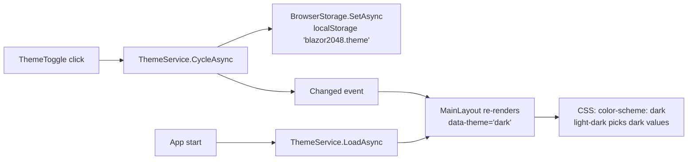
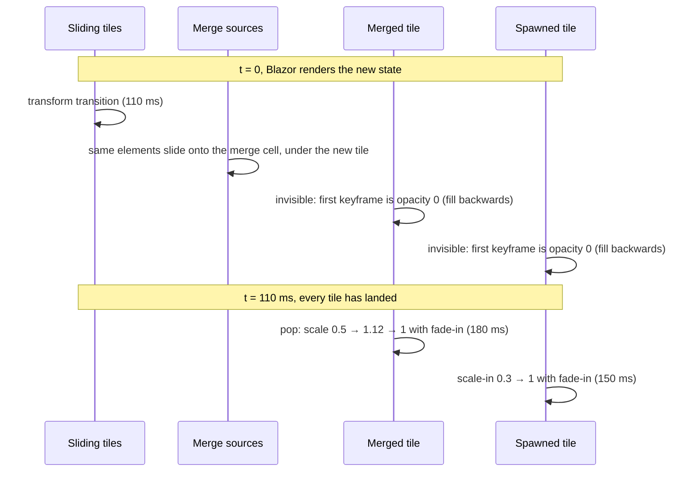

# Theming and animations

Both features are pure CSS driven by state that Blazor renders. Neither uses JavaScript.

## Theme tokens

Every color in `wwwroot/css/app.css` is a CSS custom property defined once on `:root` with
[`light-dark()`](https://developer.mozilla.org/docs/Web/CSS/color_value/light-dark):

```css
:root {
    color-scheme: light dark;
    --bg:   light-dark(#f6f3ee, #121318);
    --text: light-dark(#3b3631, #eceef3);
}
.app-root[data-theme="light"] { color-scheme: light; }
.app-root[data-theme="dark"]  { color-scheme: dark; }
```

`light-dark()` picks a value from the `color-scheme` of the element that uses it. `:root` says
`light dark` (follow the OS), and `MainLayout` renders `data-theme` on `.app-root` to pin a choice.
So **System** needs no extra CSS at all: `prefers-color-scheme` is applied by the browser.



The preference is stored with the same `BrowserStorage` helper as the best score (key
`blazor2048.theme`, values `system`, `light`, `dark`).

### Palette and contrast

Tiles run from warm neutrals through orange and gold to violet, with a pink-to-violet gradient for
4096 and beyond. Each tile has a background/foreground pair that meets **WCAG AA (4.5:1)** in both
themes. Low tiles (2 and 4) have separate light and dark colors so they stand out from the board.

| Tile | Background | Text | Contrast |
|---|---|---|---|
| 2 (light / dark) | `#eee6db` / `#3e4556` | `#4a4038` / `#e7e9ee` | 8.2 / 7.9 |
| 4 (light / dark) | `#ecdcc0` / `#505971` | `#4a4038` / `#f2f4f8` | 7.5 / 6.3 |
| 8 | `#ffad66` | `#3a1a00` | 8.6 |
| 32 | `#f2603d` | `#2a0a00` | 5.7 |
| 64 | `#c9302c` | `#ffffff` | 5.3 |
| 512 | `#eeab22` | `#2f1f00` | 8.0 |
| 1024 | `#7b57f5` | `#ffffff` | 4.6 |
| 2048 | `#6a3df0` | `#ffffff` | 5.9 |
| 4096+ | `#d63384 → #7b3fe4` | `#ffffff` | 4.5 – 5.7 |

A unit test (`ThemePaletteTests`) parses `app.css` and fails if any tile pair drops below 4.5:1.

### Diagrams follow the theme too

Mermaid diagrams are pre-rendered twice (light and dark palettes). CSS shows the variant that
matches `data-theme`, or `prefers-color-scheme` in System mode. See [Docs system](docs-system.md).

## Animations

Goals: smooth slides, a merge "pop", a spawn scale-in, **no lag and no dropped input**. Only
`transform` and `opacity` animate, so every animation can run on the compositor.

### Positioned tiles with stable keys

Tiles are absolutely positioned in a `.tile-layer` over the grid. Each tile's position is an inline
`transform` in multiples of `--step` (one cell plus one gap), from a per-size cache in `GameBoard`:

```html
<div class="tile tile-8 tl-1" style="transform:translate(calc(var(--step)*2),calc(var(--step)*1))">
  <div class="tile-inner">8</div>
</div>
```

```css
.tile { transition: transform var(--slide) var(--ease-out); contain: size layout style; }
```

Each element is keyed per tile (`@key`). When a tile slides, Blazor keeps the same element and only
updates its `style`; the browser transitions `transform` on the compositor. Only `transform` and
`opacity` animate, so there is no layout work.

Until board sizes, the position was two custom properties (`--r`/`--c`) and a `transform` rule that
read them. On a 16x16 board that made style recalculation the biggest cost of a move: a custom
property is inherited, so changing it on a tile also restyles its `.tile-inner`, and every tile got
its own copy of the inherited custom property map. Setting `transform` directly (not inherited)
means a slide restyles only the tile, not its child (see [Big boards](#big-boards)).

### Merges and spawns



- The two tiles that merge keep their ids, so Blazor keeps their elements and the browser slides
  them all the way into the target cell (`z-index: 0`, under the merged tile). The engine drops
  them on the next move.
- The merged tile is a **new element** (new id), so its pop plays exactly once. Both scale
  animations start with `animation-delay: var(--slide)` and `animation-fill-mode: backwards`, and
  their first keyframe has `opacity: 0`, so nothing appears until the slide has landed.
- The scale animations run on the inner `.tile-inner`, so they never fight the outer element's
  positioning `transform`.

| Token | Value | Used for |
|---|---|---|
| `--slide` | 110 ms | slide transition; delay before spawn and pop |
| `--spawn` | 150 ms | new tile scale-in |
| `--pop` | 180 ms | merged tile pop |
| `--ease-out` | `cubic-bezier(0.2, 0.8, 0.2, 1)` | snappy ease-out: most of the distance in the first frames |

### Rapid input

There are no timers and no "busy" flag. If you press another key mid-animation, the engine moves
immediately and Blazor re-renders:

- Sliding tiles **retarget from where they are**: only the inline `transform` changes on the same
  element, so the browser starts the new transition from the current animated position.
- Spawn and pop animations **keep playing**. `GameBoard.InfoFor` decides a tile's class
  (`tile-new`, `tile-merged`) when the tile first appears and keeps it for the tile's whole life,
  so the next render doesn't touch the class and can't cancel or restart the animation.
- Retired merge sources are removed on the next move, as in the original game.

Nothing is queued or dropped.

### Rendering cost

`GameBoard` overrides `ShouldRender` and only renders when something visible changed: a no-op move
(pushing tiles against a wall), a non-game key, or the re-render Blazor would normally do after the
awaited best-score save are all skipped. The N² background cells live in `BoardCells`, which only
renders when N changes, and `NewGameButton` skips the renders the board's moves would cause. Tile
classes, labels, `data-*` values and position styles come from caches, not per-render string
building, and the keyed `@for` loop reads the engine's reused render list (no enumerator or LINQ).

### Big boards

Everything on the board scales with `--n` (tiles per side, set on `.game` by `GameBoard`):

| Custom property | Value |
|---|---|
| `--board` | `min(92vw, 100dvh − 280px − safe areas, 400px + 20px × n)`: fills a phone, grows a little with N on desktop (480 px at 4x4, 600 px at 10x10) |
| `--gap` | `clamp(2px, board × 0.13 / (n + 1), 14px)`: gaps shrink as the board grows |
| `--cell` | `(board − (n + 1) × gap) / n` |
| `--step` | `cell + gap`, the distance between neighbouring tiles |
| `--tile-radius` | `clamp(3px, cell × 0.07, 6px)` |

- **Fonts follow cell size and label length.** `GameBoard` adds `tl-{length}` to each tile
  (`tl-1` … `tl-8`), and the font is a fraction of `--cell` for that length (0.5 for one or two
  characters down to 0.17 for eight), so any number fits its tile at any N.
- **Compact labels.** On 8x8 to 11x11, values from 16384 up are written `16K`, `128K`, `1M`, so
  131072 on a 10x10 phone board is four characters (about 11 px on a 31 px cell) instead of six. On
  12x12 and up (phone cells of 26 px or less) values from 1024 up are compact too (`1K`, `8K`), so a
  label is at most three characters until 131072. The full value stays in `data-value` and the
  tile's `title`.
- **Registered lengths.** `--board`, `--gap`, `--cell`, `--step` and `--tile-radius` are declared
  with `@property { syntax: '<length>' }`, so they compute to plain pixels once on `.board`.
  Unregistered, every tile re-evaluated the whole `calc()`/`min()`/`env()` chain behind `--cell` in
  its width, font size and transform each time it was restyled. On 16x16 under 4x CPU throttling,
  registering them halved the style time per restyled element (0.20 → 0.10 ms) and cut key-to-paint
  from about 47–57 ms to 35 ms. CSS containment (`contain: strict` on the tile layer and cells,
  `contain: size layout style` on tiles) and a permanent `will-change: transform` were measured
  too and did not help, so they are not used.
- **The title** is the current target (spec 011's easter egg) and can be up to nine digits; its font
  is the classic size × 4 / digits (`--digits`), so it always fits beside the scores.
- **First paint.** The board and title are hidden (`board-pending`, `title-pending`) until the saved
  size is applied, so reloading an 8x8 game never flashes a 4x4 board or "2048".

Measurements by size are in [spec 011's plan](../specs/011-board-sizes/plan.md#measurements).

### Why it felt choppy, and how it was measured

`tools/PerfTrace` (see [Testing](testing.md#animation-performance)) drives the published site with
Playwright for .NET, records a Chromium performance trace, and samples every tile's on-screen box
each frame. Over two 24-move runs per profile (desktop, desktop with 4x CPU throttling, and a
throttled phone viewport), it found two real causes:

1. **Every merge flashed.** The old pop keyframes started at `scale(0.6)` with no opacity, and
   `fill backwards` showed that frame during the delay. The doubled tile appeared instantly on
   top of the two tiles still sliding toward it (100% of merges).
2. **Rapid input snapped animations.** `tile-new`/`tile-merged` were only set for one render.
   The next move removed the class, the browser dropped the animation, and the tile jumped to full
   size (about 80 snaps in 48 fast moves).

What it ruled out: merge sources were never removed instantly (they always slid in, using the same
elements), slides never teleported when retargeted, and all animations are compositor-friendly
(`transform` and `opacity` only, no `top`/`left`, no `box-shadow` or `filter` animation).
CSS containment, permanent `will-change` and registered `@property` positions were tried and made
no measurable difference, so they were not kept. WebAssembly AOT cut Blazor's time per move by
about 38% under 4x CPU throttling, but it added about 2 MB of Brotli download (+75%) without
fewer dropped frames, so the app stays on the interpreter.

After the fix, no merge pops before its sources arrive at a normal pace (0 of about 37 per
profile; at 50 ms between keys a few still do, because the next move redirects the sources first),
and there are no scale snaps. Input stayed as fast: the median time from key press to updated
DOM went from 3.9 to 3.4 ms on desktop and from 18–20 to 13.5–18.7 ms under 4x throttling. Under 4x
throttling, the first one or two frames of each move can still drop while the main thread runs the
move; the slides themselves run on the compositor.

### Reduced motion

`@media (prefers-reduced-motion: reduce)` turns off the tile transitions and all keyframe
animations. Tiles jump straight to their new positions.
