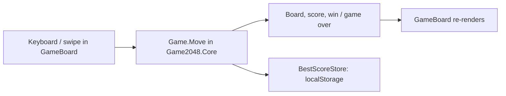

# Implementation Plan: Core game

**Feature**: `001-core-game` | **Date**: 2026-10-08 | **Spec**: [spec.md](spec.md)

## Summary

A pure C# engine (`src/Game2048.Core/Game.cs`) holds the board and the rules; a Blazor
WebAssembly PWA (`src/Blazor2048`) renders it in one `GameBoard` component and handles keyboard
and touch input in C#. GitHub Actions publishes the app and deploys it to Pages.

## Technical Context

- **Language/Version**: C# / .NET 10 (first built on .NET 9)
- **Primary Dependencies**: Microsoft.AspNetCore.Components.WebAssembly (MIT)
- **Storage**: `localStorage` key `blazor2048.best` (through `BestScoreStore`)
- **Testing**: xUnit v3 (engine), bUnit (GameBoard), Playwright for .NET (published site)
- **Target Platform**: Modern desktop and mobile browsers, GitHub Pages under `/blazor-2048/`
- **Constraints**: Works offline (service worker), no server code

## Constitution Check

| Principle | Status | Notes |
|---|---|---|
| I. Blazor/C# first | ✅ | Input, rules and rendering in C#; only localStorage and focus use interop. |
| II. .NET 10 | ✅ | Retargeted from net9.0 in [`bc0de4d`](https://github.com/gkizior/blazor-2048/commit/bc0de4d). |
| III. Tested | ✅ | GameTests, GameBoardTests, GameE2ETests. |
| IV. Dependencies | ✅ | Only Microsoft packages (MIT). |
| V. Pages deploy | ✅ | `.github/workflows/deploy.yml`, `scripts/prepare-pages.py`. |
| VI. Accessible | ✅ | Keyboard and touch; contrast handled in 003. |
| VII. Documented | ✅ | `docs/game-engine.md`, `docs/architecture.md`. |
| VIII. Spec first | ⚠️ | Reconstructed after the fact (the game predates the specs). |

## Design



- The engine has no Blazor dependency, so rules are unit-tested directly.
- `scripts/prepare-pages.py` rewrites `<base href>` to `/blazor-2048/`, copies `index.html` to
  `404.html` for deep links and adds `.nojekyll`.
- The service worker caches the published assets for offline play.

## Project Structure

```text
src/Game2048.Core/Game.cs           engine
src/Blazor2048/Components/GameBoard.razor
src/Blazor2048/Services/BestScoreStore.cs
src/Blazor2048/wwwroot/             index.html, manifest, service worker, icons
scripts/prepare-pages.py            Pages base path + 404 fallback
tests/Blazor2048.Tests/GameTests.cs
tests/Blazor2048.ComponentTests/GameBoardTests.cs
tests/Blazor2048.E2ETests/GameE2ETests.cs
```
