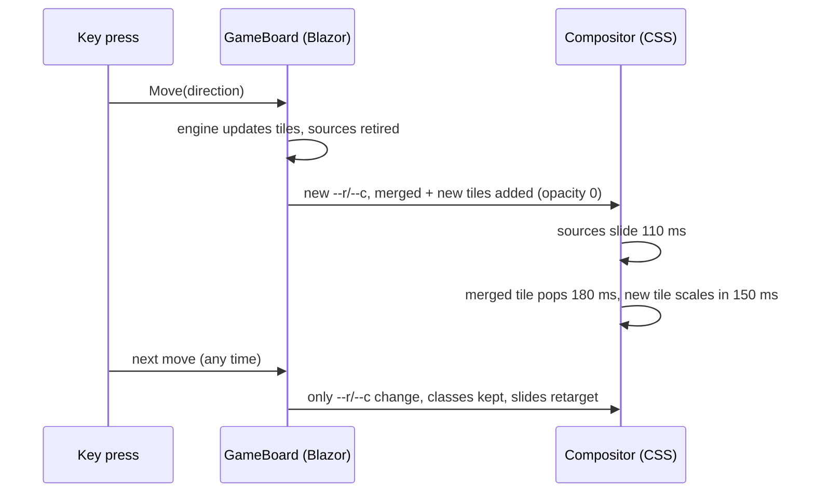

# Implementation Plan: Fluid tile animations

**Feature**: `004-fluid-animations` | **Date**: 2026-10-08 | **Spec**: [spec.md](spec.md)

## Summary

The engine gives every tile a stable id (`Tile`, `RenderTiles`), including merge sources that are
kept for one move as retired tiles. `GameBoard` renders one flat, id-ordered list keyed by id;
CSS moves tiles with a `transform` transition. The revision fixed two measured causes of
choppiness: merged tiles appearing before their sources arrived, and spawn/pop animations being
cut short by the next move.

## Technical Context

- **Primary Dependencies**: none added (Microsoft.Playwright 1.63.0, MIT, for the dev-only `tools/PerfTrace`)
- **Testing**: `TileTrackingTests`, `ThemePaletteTests.Tile_Motion_Uses_Only_Transform_And_Opacity` (xUnit), `GameBoardTests` (bUnit), `AnimationE2ETests` and `FeatureE2ETests` (Playwright)
- **Performance goals**: no early pops or snaps; no input-latency regression

## Constitution Check

| Principle | Status | Notes |
|---|---|---|
| I. Blazor/C# first | ✅ | CSS + Razor only. PerfTrace injects test-only JS into the browser it drives; nothing ships. |
| II. .NET 10 | ✅ |  |
| III. Tested | ✅ | Unit, bUnit and frame-sampling E2E tests; PerfTrace before/after evidence. |
| IV. Dependencies | ✅ | No new runtime packages; AOT rejected. |
| V. Pages deploy | ✅ |  |
| VI. Accessible | ✅ | Reduced motion disables all animation. |
| VII. Documented | ✅ | `docs/theming-and-animations.md`, `docs/testing.md`. |
| VIII. Spec first | ⚠️ | First version reconstructed; the revision was recorded here after the fix. |

## Design



## Evidence

Measured with `tools/PerfTrace`: 24 moves × 2 runs per profile, keys every 50 ms ("rapid") or
250 ms ("paced"). Medians unless noted.

| Metric | Before (`3599c00`) | After ([`6015021`](https://github.com/gkizior/blazor-2048/commit/6015021)) |
|---|---|---|
| Merges that pop before their sources arrive, paced | 97–100% | 0% |
| Merges that pop before their sources arrive, rapid | 97–100% | 7.7–8.3% |
| Spawn/pop scale snaps, rapid (48 moves) | 77–85 | 0 |
| Input → DOM, desktop | 3.9–4.0 ms | 3.1–3.4 ms |
| Input → DOM, desktop 4x throttled | 17.9–20.0 ms | 13.5–15.0 ms |
| Input → DOM, mobile 4x throttled | 18.2–19.9 ms | 14.7–18.7 ms |
| Blazor time per move, 4x throttled | 14.2–15.3 ms | 12.3–17.1 ms |
| Compositor frames dropped, 4x throttled | 10–29% | 11–32% (more animations now actually run) |
| Teleports (slides that jump) | 0 | 0 |

The live site (`3599c00`) matched the local "before" build. Raw data, a chart and a 10x slow-motion
film strip were saved with the investigation (outside the repo).

**Rejected**: CSS containment, permanent `will-change` and registered `@property` positions (no
measurable change); WebAssembly AOT (Blazor time per move at 4x went from about 14 to 9 ms, but
Brotli download grew from 2.68 to 4.68 MB, and dropped frames did not improve).

## Project Structure

```text
src/Game2048.Core/Game.cs                         Tile record, tile ids, retired merge sources
src/Blazor2048/Components/GameBoard.razor         keyed tiles, fixed classes, ShouldRender
src/Blazor2048/Components/BoardCells.razor        static cells, render once
src/Blazor2048/wwwroot/css/app.css                --slide/--spawn/--pop, keyframes, reduced motion
tests/Blazor2048.E2ETests/AnimationE2ETests.cs    per-frame sampling of real animations
tools/PerfTrace/                                  trace + glitch probe (dev only)
```
