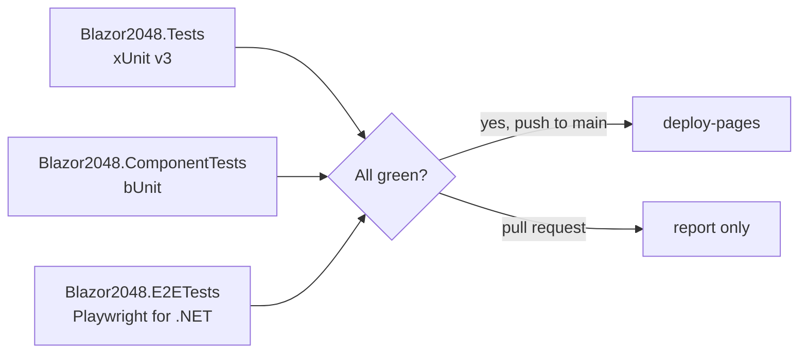

# Implementation Plan: Testing stack

**Feature**: `007-testing-stack` | **Date**: 2026-10-08 | **Spec**: [spec.md](spec.md)

## Summary

Three test projects, all xUnit v3 on Microsoft.Testing.Platform. E2E uses an xUnit v3 assembly
fixture (`SiteServer`) that serves the published `wwwroot` with Kestrel under `/blazor-2048/`,
and a base class on Playwright's `BrowserTest`.

## Technical Context

**Primary Dependencies**: xunit.v3 4.0.1 (Apache-2.0), xunit.runner.visualstudio 4.0.0 (Apache-2.0), Microsoft.NET.Test.Sdk 18.10.1 (MIT), bunit 2.11.3 (MIT), Microsoft.Playwright.Xunit.v3 1.63.0 (MIT)

## Constitution Check

| Principle | Status | Notes |
|---|---|---|
| I. Blazor/C# first | ✅ | Tests in C#; test-side JS only inside Playwright evaluations. |
| II. .NET 10 | ✅ |  |
| III. Tested | ✅ | This spec is the source of principle III. |
| IV. Dependencies | ✅ | All latest stable, Apache-2.0/MIT. |
| V. Pages deploy | ✅ | Deploy needs build + e2e jobs. |
| VI. Accessible | ✅ | Contrast and reduced-motion are tested. |
| VII. Documented | ✅ | `docs/testing.md`. |
| VIII. Spec first | ⚠️ | Reconstructed after the fact. |

## Design



## Project Structure

```text
tests/Blazor2048.Tests/            engine, tile tracking, palette, docs builder
tests/Blazor2048.ComponentTests/   bUnit: board, theme, footer, docs page
tests/Blazor2048.E2ETests/         Playwright: SiteServer fixture, AppTest base, feature + animation tests
global.json                        "test": { "runner": "Microsoft.Testing.Platform" }
```
